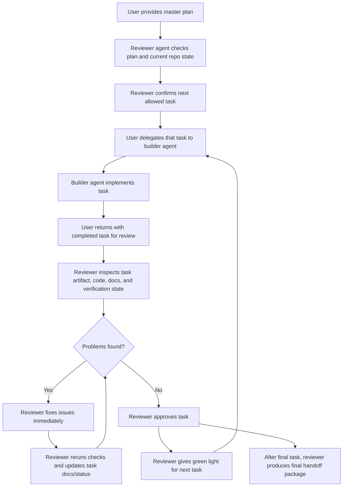
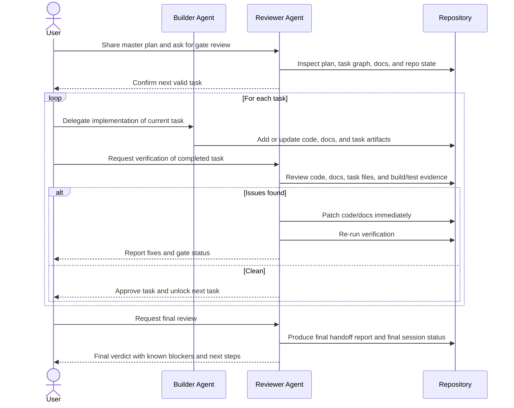
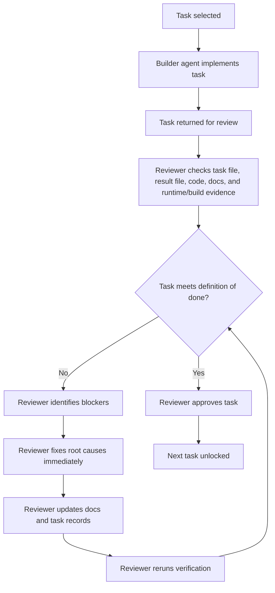

# Orchestrator Review Workflow

**Project:** Takomi Code v0.001  
**Session:** `orch-20260310-223000`

## Purpose

This document captures the exact workflow used in this project:

1. The user owned the plan and delegated implementation work to another agent.
2. The reviewer agent verified each task against the plan, repo state, and build results.
3. Any issues found were fixed immediately.
4. Only after a task passed review was the next task allowed to proceed.

## Roles

- **User:** owned direction, selected the next task, and delegated build work
- **Builder Agent:** implemented the requested task
- **Reviewer Agent:** reviewed the output, fixed issues, updated task records, and gave or withheld the green light
- **Repository:** held the source of truth for code, docs, task files, and verification artifacts

## High-Level Flow

## Actor Sequence

## Per-Task Gate Loop

## How It Went In This Project

| Phase | Tasks | What happened |
|---|---|---|
| Planning and genesis | `00-03` | The plan, architecture, issue set, and orchestrator task graph were created and reviewed first. |
| Design wave | `04-06` | Design direction and mockups were produced, reviewed, corrected, and explicitly approved before build work began. |
| Build wave | `07-16` | The builder agent implemented the app foundation and feature slices one task at a time; each task was then reviewed and fixed before moving forward. |
| Quality gate | `17` | A formal review task rejected the current state because of compile, audit, and workflow issues. |
| Fix loop | `18` | The rejected findings were repaired, re-verified, and documented until the repo was back in a passable state. |
| Finalization | `19` | A final handoff report was created summarizing readiness, scope compliance, known issues, and next steps. |

## Actual Decision Pattern Used

1. The user did not ask the reviewer agent to build first.
2. The reviewer agent first checked whether the requested task was actually the next valid task.
3. The user then used another agent to do the implementation.
4. After each implementation pass, the reviewer agent audited the output.
5. If the output was wrong, incomplete, stale, or misleading, the reviewer agent patched it directly.
6. The reviewer agent then updated task records so the repo reflected reality.
7. Only then did the reviewer agent approve the next task.

## Review Inputs Used At Each Step

- task file
- task result file
- master plan
- dependency graph
- implementation files in `src/`
- feature docs in `docs/features/`
- mockups and design docs when relevant
- build/test output
- J-Star audit/review status when available

## Approval Rules Used

- A task could move forward only if its dependencies were already satisfied.
- Design tasks had to be approved before build tasks depending on them.
- Build tasks were not treated as approved if the implementation existed but was not wired into the app.
- Documentation and task bookkeeping had to match the real repo state.
- External-tooling blockers were documented explicitly instead of being hidden.
- The final handoff could complete with an external blocker, but that blocker had to be named clearly.

## End State

The workflow ended with:

- a completed orchestrator session
- a reviewed and corrected task chain
- a final handoff report
- an explicit note that J-Star review remained blocked by external tooling setup

## Related Files

- [master_plan.md](/C:/CreativeOS/01_Projects/Code/Personal_Stuff/2026-03-10_Takomi_Code/docs/tasks/orchestrator-sessions/orch-20260310-223000/master_plan.md)
- [dependency_graph.md](/C:/CreativeOS/01_Projects/Code/Personal_Stuff/2026-03-10_Takomi_Code/docs/tasks/orchestrator-sessions/orch-20260310-223000/dependency_graph.md)
- [Builder_Handoff_Report.md](/C:/CreativeOS/01_Projects/Code/Personal_Stuff/2026-03-10_Takomi_Code/docs/Builder_Handoff_Report.md)
