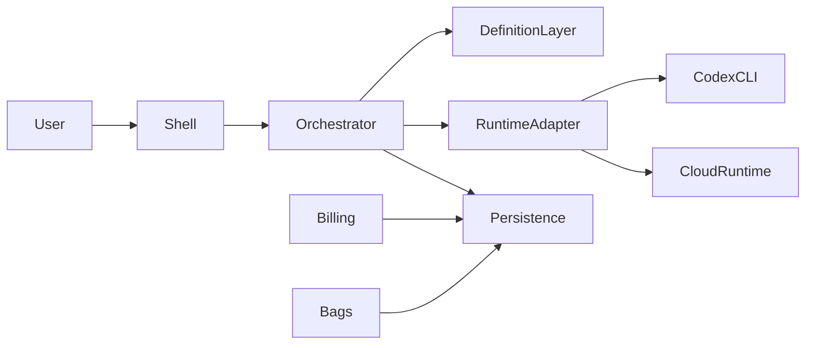

# Takomi Code System Architecture

## Overview

Takomi Code is a Windows-native orchestration shell built in WinUI 3. It coordinates Takomi workflows and modes, persists project/session state, manages workspaces and worktrees, and delegates file-editing execution to Codex CLI through a runtime adapter. The architecture preserves a single product contract across local and cloud execution.

## Major Subsystems

### 1. Desktop Shell

- WinUI 3 shell with project rail, session tabs, task inspector, runtime controls, and settings.
- View models expose project, session, task-tree, Git, billing, and verification state.

### 2. Takomi Definition Layer

- Loads `.agent/Takomi-Agents/*.yaml`.
- Loads `.agent/workflows/*.md`.
- Normalizes definitions into internal objects for modes, workflows, lifecycle stages, and task templates.

### 3. Orchestration Engine

- Creates session trees and task graphs.
- Tracks dependencies, artifacts, progress, review gates, and recovery actions.
- Supports nested orchestration and background child runs.

### 4. Runtime Adapter Layer

- `ICodeExecutionRuntime` abstracts local and cloud execution.
- `CodexCliRuntime` launches and monitors Codex CLI processes.
- `CloudExecutionRuntime` targets a remote ASP.NET Core service implementing the same request and event contract.
- Windows compatibility concerns are isolated here, including possible WSL mediation.

### 5. Persistence and Audit Layer

- SQLite stores projects, workspaces, sessions, tasks, artifacts, billing state, and audit events.
- File-system artifacts remain in the active workspace.
- Audit events are append-only and queryable in the UI.

### 6. Git and Workspace Layer

- Tracks current branch, dirty state, and explicit worktree selection.
- Same workspace is inherited by default for child sessions.
- Worktree switching updates the workspace context for a selected session subtree.

### 7. Billing and Verification Layer

- Paystack handles fiat billing and success-path entitlement activation.
- Bags integration covers token linkage, Bags API usage, and verification readiness.
- No fee-sharing logic is included.

## Core Contracts

- `ProjectContext`
- `WorkspaceContext`
- `AgentSession`
- `SessionTreeEdge`
- `WorkflowDefinition`
- `ModeDefinition`
- `TaskDefinition`
- `RunEvent`
- `ArtifactRecord`
- `BillingAccount`
- `EntitlementRecord`
- `BagsProjectRecord`

## Data Flow

## Acceptance-Critical Design Decisions

- The shell remains the system of record for orchestration state.
- Codex remains a worker, not the UX owner.
- Workflows and modes are loaded from project files to stay Takomi-aligned.
- Audit events are first-class outputs, not debug noise.
- Billing and Bags are isolated integrations with explicit event logging.
