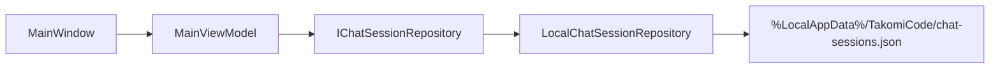

# Chat Session Core

## Overview
The chat session core provides project-scoped chats, parent-child session relationships, and durable transcript restore for the WinUI shell. It is the first runtime-backed slice of the Takomi orchestration experience and gives later tasks a stable session model to build on.

## Architecture
- **UI shell:** `src/TakomiCode.UI/MainWindow.xaml`
- **UI state:** `src/TakomiCode.UI/ViewModels/MainViewModel.cs`
- **Session wrappers:** `src/TakomiCode.UI/ViewModels/ChatSessionViewModel.cs`
- **Persistence contract:** `src/TakomiCode.Application/Contracts/Persistence/IChatSessionRepository.cs`
- **Local repository:** `src/TakomiCode.Infrastructure/Persistence/LocalChatSessionRepository.cs`

## Key Components

### `ChatSession`
`src/TakomiCode.Domain/Entities/ChatSession.cs` models a single project chat. Each session carries a `WorkspaceId`, optional `ParentSessionId`, transcript collection, and optional worktree override.

### `LocalChatSessionRepository`
The local repository persists session state to `%LocalAppData%\TakomiCode\chat-sessions.json`. Repository reads clone stored entities before returning them so UI mutations stay explicit through `SaveSessionAsync`.

### `MainViewModel`
The main view model creates a default workspace context, restores saved chats for that workspace, exposes session selection, and supports:
- creating root project chats
- creating child sessions that inherit the parent workspace and worktree
- saving transcript messages back to the repository

### `ChatSessionViewModel`
The session view model exposes transcript messages for binding and provides `CreateChildSession(...)` so parent-child inheritance stays consistent in one place.

## Data Flow

## Current Behavior
- Sessions are scoped to a workspace id.
- Child sessions inherit the same workspace id by default.
- Child sessions also inherit the parent worktree path unless an explicit override is supplied.
- Transcript messages are restored on app startup from the local JSON store.

## Constraints
- Workspace switching remains explicit and is not automated by the session core.
- Full compile verification is still pending until the WinUI/.NET toolchain is installed and `dotnet build` can be executed.
