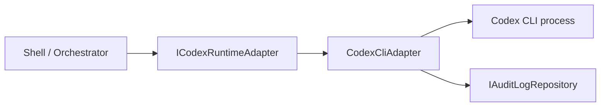

# Codex Runtime Adapter

## Overview
The Codex runtime adapter isolates local Codex CLI execution from the WinUI shell. It owns process launch, Windows-specific fallback behavior, lifecycle event emission, and lifecycle audit logging so the UI can remain orchestration-focused.

## Architecture
- **Runtime contract:** `src/TakomiCode.Application/Contracts/Runtime/ICodexRuntimeAdapter.cs`
- **Run request model:** `src/TakomiCode.Application/Contracts/Runtime/CodexRunRequest.cs`
- **Run result model:** `src/TakomiCode.Application/Contracts/Runtime/CodexRunResult.cs`
- **Lifecycle events:** `src/TakomiCode.Application/Contracts/Runtime/CodexRuntimeStateEventArgs.cs`
- **Local adapter:** `src/TakomiCode.RuntimeAdapters/Codex/CodexCliAdapter.cs`

## Key Components

### `ICodexRuntimeAdapter`
Defines the runtime boundary for starting a run, cancelling a run, and subscribing to state and output events.

### `CodexCliAdapter`
Implements the local Windows runtime path. The adapter:
- resolves the installed Codex executable with `where.exe`
- prefers a direct `.exe` launch when available
- falls back to the Windows command shell for `.cmd` and `.bat` shims
- emits structured lifecycle state changes
- captures stdout and stderr as runtime output events
- appends lifecycle events to the audit log repository

### Failure Handling
The adapter treats these cases as first-class runtime failures:
- missing Codex CLI on `PATH`
- invalid working directory or request payload
- authentication-related output from Codex
- non-zero process exit codes
- explicit cancellation

## Data Flow

## Current Behavior
- Runtime state transitions are emitted as `Starting`, `Running`, `Completed`, `Failed`, or `Cancelled`.
- Lifecycle transitions are mirrored into audit events using `runtime.*` event types.
- Windows shell mediation is adapter-local and does not leak into UI logic.
- Cancellation attempts terminate the full process tree for the active run.

## Constraints
- The adapter still depends on a locally installed Codex CLI.
- Full compilation and adapter execution tests remain pending until the .NET SDK is installed and `dotnet build` is available.
