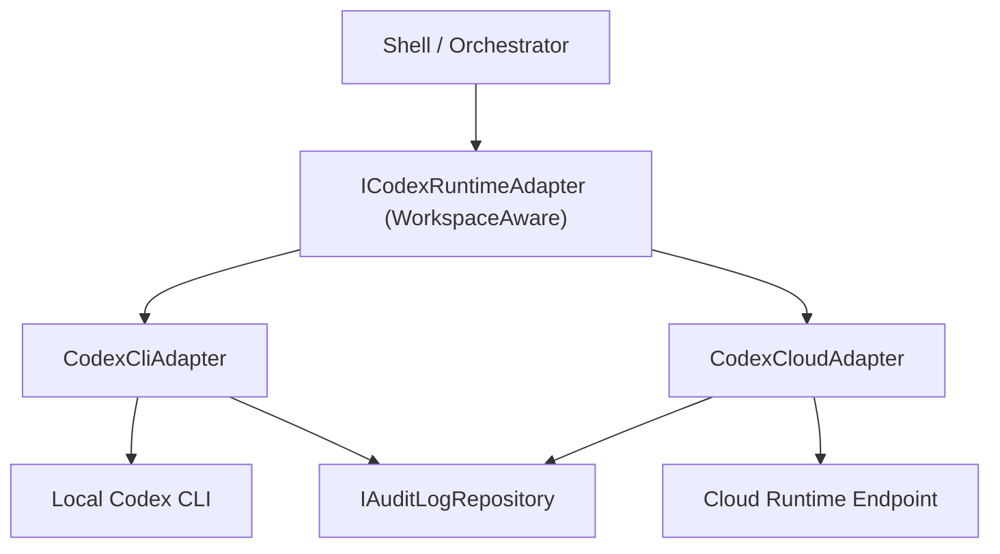

# Codex Runtime Adapter

## Overview
The Codex runtime adapter isolates local Codex CLI execution from the WinUI shell. It owns process launch, Windows-specific fallback behavior, lifecycle event emission, and lifecycle audit logging so the UI can remain orchestration-focused.

## Architecture
- **Runtime contract:** `src/TakomiCode.Application/Contracts/Runtime/ICodexRuntimeAdapter.cs`
- **Run request model:** `src/TakomiCode.Application/Contracts/Runtime/CodexRunRequest.cs`
- **Run result model:** `src/TakomiCode.Application/Contracts/Runtime/CodexRunResult.cs`
- **Lifecycle events:** `src/TakomiCode.Application/Contracts/Runtime/CodexRuntimeStateEventArgs.cs`
- **Local adapter:** `src/TakomiCode.RuntimeAdapters/Codex/CodexCliAdapter.cs`
- **Cloud adapter:** `src/TakomiCode.RuntimeAdapters/Codex/CodexCloudAdapter.cs`
- **Delegating adapter:** `src/TakomiCode.RuntimeAdapters/Codex/WorkspaceAwareCodexRuntimeAdapter.cs`

## Key Components

### `ICodexRuntimeAdapter`
Defines the runtime boundary for starting a run, cancelling a run, and subscribing to state and output events.

### `CodexCliAdapter`
Implements the local Windows runtime path. The adapter:
- resolves the installed Codex executable with `where.exe`
- prefers a direct `.exe` launch when available
- falls back to the Windows command shell for `.cmd` and `.bat` shims
- emits structured lifecycle state changes
- captures stdout and stderr as runtime output events
- appends lifecycle events to the audit log repository

### `CodexCloudAdapter`
Implements a mock/proxy for remote execution. This allows for cloud-based orchestration without altering shell logic. It mirrors the local runtime semantics (events, output, interventions) but targets a remote environment.

### `WorkspaceAwareCodexRuntimeAdapter`
A delegating facade that routes execution to either the Local or Cloud adapter based on the workspace's `RuntimeTarget` setting. This ensures that the `OrchestratorExecutionEngine` and UI remain target-agnostic.

### Failure Handling
The adapter treats these cases as first-class runtime failures:
- missing Codex CLI on `PATH` (Local)
- invalid working directory or request payload
- authentication-related output from Codex
- non-zero process exit codes
- explicit cancellation

## Data Flow

## Current Behavior
- Runtime state transitions are emitted as `Starting`, `Running`, `Completed`, `Failed`, `Cancelled`, or `Paused`.
- Lifecycle transitions are mirrored into audit events using `runtime.*` (Local) or `runtime.cloud.*` (Cloud) event types.
- Windows shell mediation is adapter-local and does not leak into UI logic.
- Runtime target can be switched per workspace, persisting the selection.

## Constraints
- The Local adapter requires a locally installed Codex CLI.
- The Cloud adapter is currently a mock for verification and parity testing.
- Intervention handling (Pause/Resume/Cancel) is supported across both targets.
