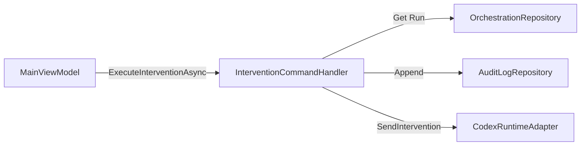

# Intervention Controls

## Overview
The Intervention Controls feature implements the live intervention model for active orchestrator runs and exposes these controls in the WinUI shell. It ensures that operations like pausing, resuming, cancelling, re-routing, migrating, replacing, and injecting guidance are available and generate a durable structured audit trail.

## Architecture
- **Entities:** `TakomiCode.Domain.Entities.InterventionAction`
- **Application Services:** `TakomiCode.Application.Services.InterventionCommandHandler`, `TakomiCode.Application.Contracts.Services.IInterventionCommandHandler`
- **Adapters:** `TakomiCode.RuntimeAdapters.Codex.CodexCliAdapter`, `TakomiCode.Infrastructure.Persistence.LocalOrchestrationRepository`
- **UI View Models:** `TakomiCode.UI.ViewModels.MainViewModel`

## Key Components

### InterventionCommandHandler
Orchestrates intervention actions by validating the run state via `IOrchestrationRepository`, emitting structured intervention audit events, updating persisted run/task state for supported actions, and instructing the runtime adapter (`ICodexRuntimeAdapter`) to execute the intervention.

### CodexCliAdapter Integration
Currently routes cancellations to the process-level `CancelRunAsync`. Other interventions (Guidance, Pause, Resume, Replace, Migrate, Reroute) explicitly fail with `NotSupportedException`, while the handler records `intervention.unsupported` audit events and the shell surfaces clear feedback.

### MainViewModel (UI)
Monitors active orchestration runs and exposes `[RelayCommand]` endpoints for each intervention type. It feeds the `Active Runs` panel in the primary WinUI window.

## Data Flow

## Audit Trail Tracking
Every intervention triggers an `AuditEvent` with type `intervention.requested`, followed by `intervention.applied`, `intervention.unsupported`, or `intervention.failed` depending on outcome. Audit events are stored durably in `%LocalAppData%\TakomiCode\audit-events.json`, so interventions are not treated as transient UI state.
