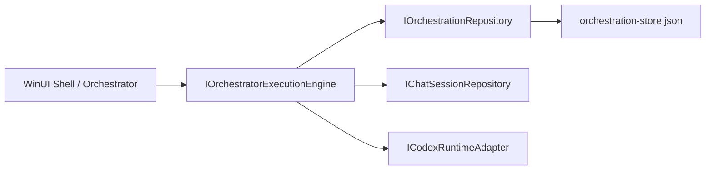

# Orchestrator Execution Engine

## Overview
The orchestrator execution engine owns task-graph execution state for Takomi sessions. It models orchestration sessions, task dependencies, background child runs, and task artifacts while keeping the app shell as the single source of truth for orchestration progress.

## Architecture
- **Domain models:** `src/TakomiCode.Domain/Entities/Orchestration.cs`
- **Repository contract:** `src/TakomiCode.Application/Contracts/Persistence/IOrchestrationRepository.cs`
- **Execution contract:** `src/TakomiCode.Application/Contracts/Services/IOrchestratorExecutionEngine.cs`
- **Engine implementation:** `src/TakomiCode.Application/Services/OrchestratorExecutionEngine.cs`
- **Local persistence:** `src/TakomiCode.Infrastructure/Persistence/LocalOrchestrationRepository.cs`

## Key Components

### `OrchestrationSession`
Represents a top-level orchestration wave for a workspace. The session stores the original prompt, overall status, and the task set associated with the session id.

### `OrchestrationTask`
Tracks a single orchestrated task file, its dependencies, target mode, optional parent task, optional execution command, execution runs, and attached artifacts.

### `OrchestrationRun`
Represents a concrete task execution attempt. Runs can point to a parent run to model parent-child execution trees and can also link to the child chat session created for that run.

### `OrchestratorExecutionEngine`
The engine:
- creates orchestration sessions
- adds tasks and dependency edges
- creates child chat sessions for task runs
- queues and dispatches background Codex-backed runs when an execution command is present
- records completion, failure, and artifacts back into the orchestration repository
- unblocks dependency-blocked tasks during background monitoring

### `LocalOrchestrationRepository`
Stores orchestration sessions, tasks, runs, and artifacts in `%LocalAppData%\TakomiCode\orchestration-store.json`. Corrupt stores are quarantined so the shell can recover cleanly.

## Data Flow

## Current Behavior
- Parent-child task relationships can be modeled through `ParentTaskId`.
- Parent-child run relationships can be modeled through `ParentRunId`.
- Dependency-blocked tasks remain blocked until `BackgroundMonitorRunsAsync(...)` sees their prerequisites complete.
- Result documents and other artifacts can be attached to a task/run pair explicitly.
- Result file path derivation stays aligned with the existing `docs/tasks/.../*.task.md` to `*.result.md` convention.

## Constraints
- The engine remains the state owner for task graph execution.
- Full compile and runtime verification is still blocked until the .NET SDK is installed and `dotnet build` can be executed.
