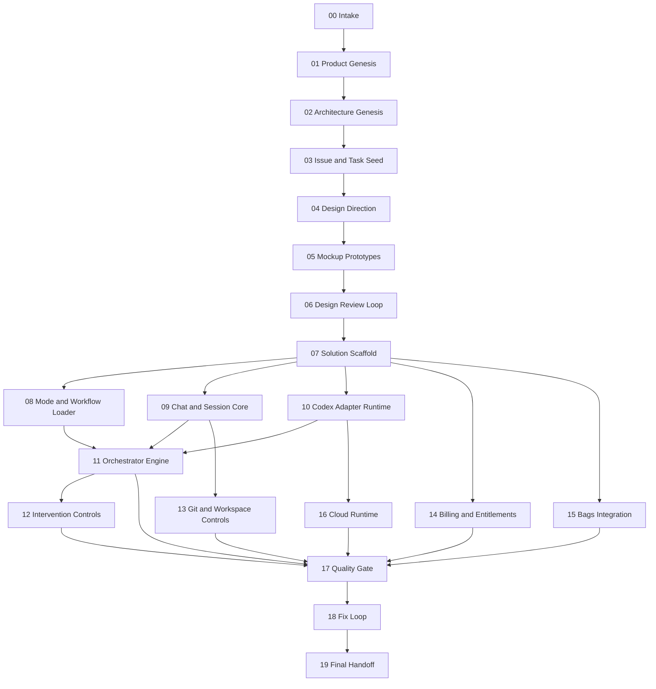

# Dependency Graph

## Notes

- Design review is a hard gate before build work starts.
- Tasks `08`, `09`, and `10` can progress in parallel after scaffolding.
- Tasks `14`, `15`, and `16` may begin once the build foundation is stable enough to host integration code.
- `17` through `19` are sequential quality and closure stages.
