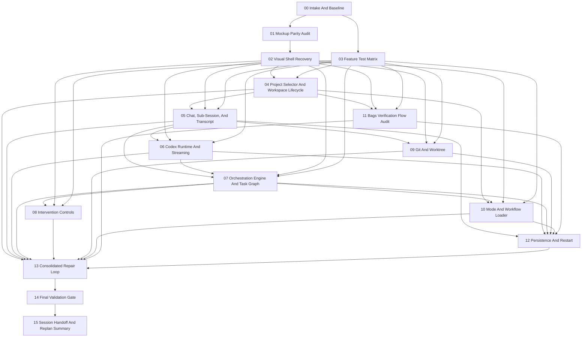

# Dependency Graph

## Notes

- `02 Visual Shell Recovery` remains an early hard gate because feature testing otherwise generates UI noise.
- `04` through `12` are now feature-specific validation slices, ordered to follow the actual product spine: workspace -> session -> runtime -> orchestration -> interventions -> workspace tooling -> persistence.
- `13` collects confirmed defects into one controlled repair loop after the higher-signal validation tasks complete.
- `14` is the only step allowed to declare the tested application ready for the next milestone.
