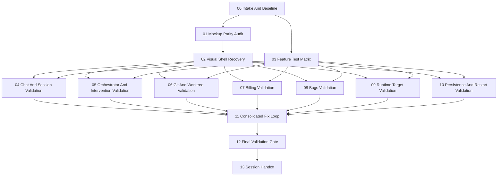

# Dependency Graph

## Notes

- `02 Visual Shell Recovery` is an early hard gate because feature testing will otherwise generate noise from an obviously wrong shell.
- `04` through `10` are intended as sequentially reviewed validation slices, but can be delegated independently after the shell and test matrix are stable.
- `11` collects all confirmed defects and parity gaps into one controlled recovery loop.
- `12` is the only step allowed to declare the tested application ready for the next milestone.
